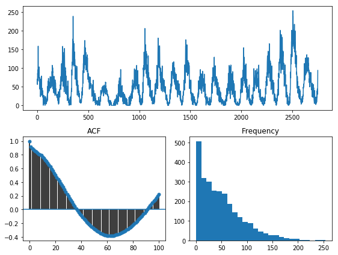
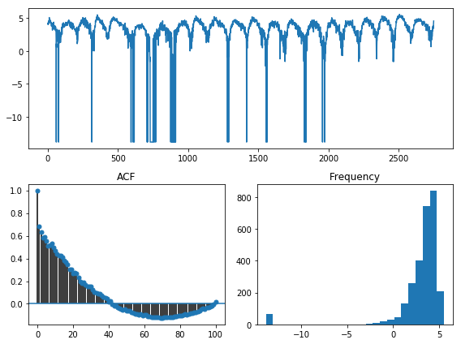
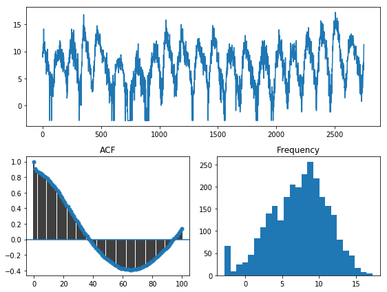
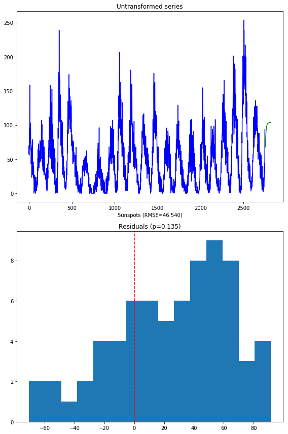
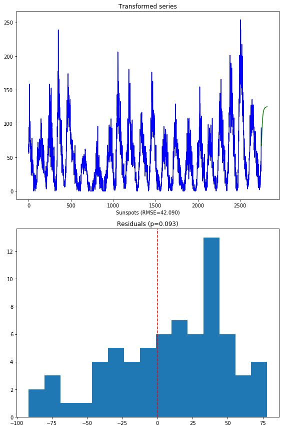

.. title:: Model selection with cross-validation

.. _sun_spots:

==================================
An end-to-end time series analysis
==================================

In this example, we're going to look at why the :func:`pmdarima.arima.auto_arima` method
should not be used as a silver bullet, and why qualitative investigation of the data
may reveal important characteristics about it which may, in turn, affect how you approach
the problem.

For this problem, we'll use the :func:`pmdarima.datasets.load_sunspots` method, which
loads a seasonal time series of monthly mean relative sunspot numbers from 1749 to 1983.

Here's what you'll need to run this example:

  * Pmdarima 1.5.2+ (many plotting utilities were added in this version)

  * Matplotlib - It's not a hard requirement of the package itself, but you'll need it
    to run these examples (if you're running this in a notebook, make sure to include ``%matplotlib inline``)

  * Python 3.6+

Imports, data loading & splitting
---------------------------------

Here's the set up for our problem. We'll load the data and split it into our
train/test sets:

.. code-block:: python

    import numpy as np
    import pandas as pd
    import matplotlib.pyplot as plt
    # %matplotlib inline

    import pmdarima as pm
    from pmdarima.datasets import load_sunspots
    from pmdarima.model_selection import train_test_split
    print(f"Using pmdarima {pm.__version__}")
    # Using pmdarima 1.5.2

    y = load_sunspots(True)
    train_len = 2750
    y_train, y_test = train_test_split(y, train_size=train_len)
    y_train.head()

======== =======
Jan 1749    58.0
Feb 1749    62.6
Mar 1749    70.0
Apr 1749    55.7
May 1749    85.0
dtype:   float64
======== =======

Time series data is a bit different from traditional machine learning in the sense
that it's temporally sensitive. That means the larger our test set, the higher we
would expect our error to be for later forecasts, since our model won't be able to
effectively forecast for too many periods into the future.

For this example, we'll take the first 2750 samples for training, and leave the last
70 as our test set.

Examining the data
------------------

Pmdarima 1.5.2 introduced a handy utility for visualizing your time series data:
:func:`pmdarima.utils.visualization.tsdisplay`. We can use this to visualize our data,
take a look at the auto-correlation plot, and see the histogram of values:

.. code-block:: python

    from pmdarima.utils import tsdisplay

    tsdisplay(y_train, lag_max=100)

Reading this plot can give us several pieces of information:

* We are looking at a seasonal time series. Our apriori knowledge of the dataset informs
  us that this data has a seasonal periodicity of ``m=12``.
* There seems to be some significant data skew, looking at the histogram. It is
  very zero-inflated. A lot of the statistical techniques used in time series modeling
  behave better when the data is normally distributed, so this may be something to look
  into.

Fitting a baseline
------------------

Before we start manipulating our data, let's examine what would happen if we just
fit a model straight out of the box:

.. code-block:: python

   fit1 = pm.auto_arima(y_train, m=12, trace=True, suppress_warnings=True)

::

    Fit ARIMA: order=(2, 1, 2) seasonal_order=(1, 0, 1, 12); AIC=22834.181, BIC=22881.533, Fit time=7.496 seconds
    Fit ARIMA: order=(0, 1, 0) seasonal_order=(0, 0, 0, 12); AIC=23347.880, BIC=23359.718, Fit time=0.053 seconds
    Fit ARIMA: order=(1, 1, 0) seasonal_order=(1, 0, 0, 12); AIC=23087.391, BIC=23111.067, Fit time=0.458 seconds
    Fit ARIMA: order=(0, 1, 1) seasonal_order=(0, 0, 1, 12); AIC=22931.725, BIC=22955.401, Fit time=1.314 seconds
    Fit ARIMA: order=(0, 1, 0) seasonal_order=(0, 0, 0, 12); AIC=23345.881, BIC=23351.800, Fit time=0.030 seconds
    Fit ARIMA: order=(2, 1, 2) seasonal_order=(0, 0, 1, 12); AIC=22834.415, BIC=22875.848, Fit time=6.067 seconds
    Fit ARIMA: order=(2, 1, 2) seasonal_order=(1, 0, 0, 12); AIC=22834.465, BIC=22875.898, Fit time=8.268 seconds
    Fit ARIMA: order=(2, 1, 2) seasonal_order=(2, 0, 1, 12); AIC=22842.107, BIC=22895.378, Fit time=34.407 seconds
    Near non-invertible roots for order (2, 1, 2)(2, 0, 1, 12); setting score to inf (at least one inverse root too close to the border of the unit circle: 0.995)
    Fit ARIMA: order=(2, 1, 2) seasonal_order=(1, 0, 2, 12); AIC=22844.771, BIC=22898.042, Fit time=28.426 seconds
    Near non-invertible roots for order (2, 1, 2)(1, 0, 2, 12); setting score to inf (at least one inverse root too close to the border of the unit circle: 0.997)
    Fit ARIMA: order=(2, 1, 2) seasonal_order=(0, 0, 0, 12); AIC=22832.862, BIC=22868.375, Fit time=2.334 seconds
    Fit ARIMA: order=(1, 1, 2) seasonal_order=(0, 0, 0, 12); AIC=22896.004, BIC=22925.599, Fit time=0.658 seconds
    Fit ARIMA: order=(2, 1, 1) seasonal_order=(0, 0, 0, 12); AIC=22895.198, BIC=22924.793, Fit time=0.567 seconds
    Fit ARIMA: order=(3, 1, 2) seasonal_order=(0, 0, 0, 12); AIC=22830.683, BIC=22872.115, Fit time=2.810 seconds
    Fit ARIMA: order=(3, 1, 2) seasonal_order=(1, 0, 0, 12); AIC=22832.671, BIC=22880.023, Fit time=8.964 seconds
    Fit ARIMA: order=(3, 1, 2) seasonal_order=(0, 0, 1, 12); AIC=22832.590, BIC=22879.942, Fit time=8.747 seconds
    Fit ARIMA: order=(3, 1, 2) seasonal_order=(1, 0, 1, 12); AIC=22834.543, BIC=22887.814, Fit time=8.893 seconds
    Near non-invertible roots for order (3, 1, 2)(1, 0, 1, 12); setting score to inf (at least one inverse root too close to the border of the unit circle: 0.998)
    Fit ARIMA: order=(3, 1, 1) seasonal_order=(0, 0, 0, 12); AIC=22895.344, BIC=22930.857, Fit time=0.997 seconds
    Fit ARIMA: order=(4, 1, 2) seasonal_order=(0, 0, 0, 12); AIC=22829.697, BIC=22877.049, Fit time=3.447 seconds
    Fit ARIMA: order=(4, 1, 2) seasonal_order=(1, 0, 0, 12); AIC=22831.750, BIC=22885.021, Fit time=11.401 seconds
    Fit ARIMA: order=(4, 1, 2) seasonal_order=(0, 0, 1, 12); AIC=22831.704, BIC=22884.975, Fit time=9.325 seconds
    Fit ARIMA: order=(4, 1, 2) seasonal_order=(1, 0, 1, 12); AIC=22832.081, BIC=22891.271, Fit time=13.537 seconds
    Near non-invertible roots for order (4, 1, 2)(1, 0, 1, 12); setting score to inf (at least one inverse root too close to the border of the unit circle: 0.999)
    Fit ARIMA: order=(4, 1, 1) seasonal_order=(0, 0, 0, 12); AIC=22897.185, BIC=22938.618, Fit time=1.096 seconds
    Fit ARIMA: order=(5, 1, 2) seasonal_order=(0, 0, 0, 12); AIC=22899.855, BIC=22953.126, Fit time=2.716 seconds
    Fit ARIMA: order=(4, 1, 3) seasonal_order=(0, 0, 0, 12); AIC=22834.222, BIC=22887.493, Fit time=4.503 seconds
    Fit ARIMA: order=(3, 1, 3) seasonal_order=(0, 0, 0, 12); AIC=22890.085, BIC=22937.437, Fit time=3.098 seconds
    Fit ARIMA: order=(5, 1, 1) seasonal_order=(0, 0, 0, 12); AIC=22898.389, BIC=22945.741, Fit time=1.600 seconds
    Fit ARIMA: order=(5, 1, 3) seasonal_order=(0, 0, 0, 12); AIC=22894.744, BIC=22953.934, Fit time=4.333 seconds

Examining the summary gives us:

.. code-block:: python

    fit1.summary()

::

                               Statespace Model Results
    ==============================================================================
    Dep. Variable:                      y   No. Observations:                 2750
    Model:               SARIMAX(4, 1, 2)   Log Likelihood              -11406.849
    Date:                Fri, 13 Dec 2019   AIC                          22829.697
    Time:                        07:46:18   BIC                          22877.049
    Sample:                             0   HQIC                         22846.806
                                   - 2750
    Covariance Type:                  opg
    ==============================================================================
                     coef    std err          z      P>|z|      [0.025      0.975]
    ------------------------------------------------------------------------------
    intercept      0.0012      0.012      0.104      0.917      -0.022       0.024
    ar.L1          1.3845      0.025     55.356      0.000       1.335       1.433
    ar.L2         -0.3867      0.027    -14.352      0.000      -0.440      -0.334
    ar.L3         -0.0085      0.025     -0.340      0.734      -0.058       0.040
    ar.L4         -0.0394      0.017     -2.264      0.024      -0.073      -0.005
    ma.L1         -1.8193      0.020    -91.747      0.000      -1.858      -1.780
    ma.L2          0.8570      0.020     42.443      0.000       0.817       0.897
    sigma2       235.3266      4.006     58.739      0.000     227.474     243.179
    ===================================================================================
    Ljung-Box (Q):                       79.17   Jarque-Bera (JB):              1261.11
    Prob(Q):                              0.00   Prob(JB):                         0.00
    Heteroskedasticity (H):               1.21   Skew:                             0.31
    Prob(H) (two-sided):                  0.00   Kurtosis:                         6.26
    ===================================================================================

    Warnings:
    [1] Covariance matrix calculated using the outer product of gradients (complex-step).

Transforming our data
---------------------

Since we expect our model to perform better over more normal data, let's experiment with log transformations and
the `Box-Cox transformation <https://en.wikipedia.org/wiki/Power_transform#Box–Cox_transformation>`_,
each of which is provided as an endogenous transformer in the Pmdarima package.

.. code-block:: python

    from pmdarima.preprocessing import LogEndogTransformer

    y_train_log, _ = LogEndogTransformer(lmbda=1e-6).fit_transform(y_train)
    tsdisplay(y_train_log, lag_max=100)

Hmm... The log transformation didn't seem to help too much. In fact, it seems like it just
shifted the skew to the other tail. Let's try the Box-Cox transformation. When ``.fit()`` is called,
it will learn the lambda transformation parameter:

.. code-block:: python

    from pmdarima.preprocessing import BoxCoxEndogTransformer

    y_train_bc, _ = BoxCoxEndogTransformer(lmbda2=1e-6).fit_transform(y_train)
    tsdisplay(y_train_bc, lag_max=100)

However, the Box-Cox transformation seems to work very well as a means to normalize the data!
In fact, a test of normality shows overwhelmingly that this is a normal distribution:

.. code-block:: python

    from scipy.stats import normaltest
    normaltest(y_train_bc)[1]
    # 3.751017646057429e-14

Fitting the transformed data
----------------------------

Pmdarima implements a scikit-learn-esque pipeline used to chain transformations and
estimators together. Using this, we can centralize the entire transformer/model fit into
one metaestimator:

.. code-block:: python

    from pmdarima.pipeline import Pipeline

    fit2 = Pipeline([
        ('boxcox', BoxCoxEndogTransformer(lmbda2=1e-6)),
        ('arima', pm.AutoARIMA(trace=True,
                               suppress_warnings=True,
                               m=12))
    ])

    fit2.fit(y_train)

::

    Fit ARIMA: order=(2, 1, 2) seasonal_order=(1, 0, 1, 12); AIC=9944.949, BIC=9992.301, Fit time=9.227 seconds
    Fit ARIMA: order=(0, 1, 0) seasonal_order=(0, 0, 0, 12); AIC=10560.255, BIC=10572.093, Fit time=0.049 seconds
    Fit ARIMA: order=(1, 1, 0) seasonal_order=(1, 0, 0, 12); AIC=10190.842, BIC=10214.518, Fit time=0.541 seconds
    Fit ARIMA: order=(0, 1, 1) seasonal_order=(0, 0, 1, 12); AIC=10000.189, BIC=10023.865, Fit time=1.834 seconds
    Fit ARIMA: order=(0, 1, 0) seasonal_order=(0, 0, 0, 12); AIC=10558.255, BIC=10564.174, Fit time=0.057 seconds
    Fit ARIMA: order=(2, 1, 2) seasonal_order=(0, 0, 1, 12); AIC=9944.067, BIC=9985.500, Fit time=7.050 seconds
    Fit ARIMA: order=(2, 1, 2) seasonal_order=(0, 0, 0, 12); AIC=9942.145, BIC=9977.659, Fit time=2.284 seconds
    Fit ARIMA: order=(2, 1, 2) seasonal_order=(1, 0, 0, 12); AIC=9944.073, BIC=9985.506, Fit time=7.021 seconds
    Fit ARIMA: order=(1, 1, 2) seasonal_order=(0, 0, 0, 12); AIC=9987.000, BIC=10016.595, Fit time=0.626 seconds
    Fit ARIMA: order=(2, 1, 1) seasonal_order=(0, 0, 0, 12); AIC=9986.300, BIC=10015.895, Fit time=0.697 seconds
    Fit ARIMA: order=(3, 1, 2) seasonal_order=(0, 0, 0, 12); AIC=9938.391, BIC=9979.824, Fit time=2.610 seconds
    Fit ARIMA: order=(3, 1, 2) seasonal_order=(1, 0, 0, 12); AIC=9939.926, BIC=9987.278, Fit time=12.276 seconds
    Fit ARIMA: order=(3, 1, 2) seasonal_order=(0, 0, 1, 12); AIC=9939.653, BIC=9987.005, Fit time=8.903 seconds
    Fit ARIMA: order=(3, 1, 2) seasonal_order=(1, 0, 1, 12); AIC=9941.966, BIC=9995.237, Fit time=12.801 seconds
    Near non-invertible roots for order (3, 1, 2)(1, 0, 1, 12); setting score to inf (at least one inverse root too close to the border of the unit circle: 0.996)
    Fit ARIMA: order=(3, 1, 1) seasonal_order=(0, 0, 0, 12); AIC=9982.150, BIC=10017.664, Fit time=0.734 seconds
    Fit ARIMA: order=(4, 1, 2) seasonal_order=(0, 0, 0, 12); AIC=9985.360, BIC=10032.711, Fit time=2.084 seconds
    Fit ARIMA: order=(3, 1, 3) seasonal_order=(0, 0, 0, 12); AIC=9982.528, BIC=10029.880, Fit time=3.890 seconds
    Fit ARIMA: order=(2, 1, 3) seasonal_order=(0, 0, 0, 12); AIC=9981.766, BIC=10023.199, Fit time=2.940 seconds
    Fit ARIMA: order=(4, 1, 1) seasonal_order=(0, 0, 0, 12); AIC=9983.484, BIC=10024.917, Fit time=1.505 seconds
    Fit ARIMA: order=(4, 1, 3) seasonal_order=(0, 0, 0, 12); AIC=9987.366, BIC=10040.637, Fit time=1.602 seconds
    Pipeline(steps=[('boxcox',
                     BoxCoxEndogTransformer(floor=1e-16, lmbda=None, lmbda2=1e-06,
                                            neg_action='raise')),
                    ('arima',
                     AutoARIMA(D=None, alpha=0.05, d=None, error_action='warn',
                               information_criterion='aic', m=12, max_D=1, max_P=2,
                               max_Q=2, max_d=2, max_order=5, max_p=5, max_q=5,
                               maxiter=50, method='lbfgs', n_fits=10, n_jobs=1,
                               offset_test_args=None, out_of_sample_size=0,
                               random=False, random_state=None, scoring='mse',
                               scoring_args=None, seasonal=True,
                               seasonal_test='ocsb', seasonal_test_args=None,
                               start_P=1, start_Q=1, start_p=2, start_params=None, ...))])

And the model summary:

.. code-block:: python

    fit2.summary()

::

                               Statespace Model Results
    ==============================================================================
    Dep. Variable:                      y   No. Observations:                 2750
    Model:               SARIMAX(3, 1, 2)   Log Likelihood               -4962.196
    Date:                Fri, 13 Dec 2019   AIC                           9938.391
    Time:                        08:17:33   BIC                           9979.824
    Sample:                             0   HQIC                          9953.361
                                   - 2750
    Covariance Type:                  opg
    ==============================================================================
                     coef    std err          z      P>|z|      [0.025      0.975]
    ------------------------------------------------------------------------------
    intercept   9.133e-05      0.001      0.076      0.940      -0.002       0.002
    ar.L1          1.2561      0.026     47.432      0.000       1.204       1.308
    ar.L2         -0.2495      0.025    -10.071      0.000      -0.298      -0.201
    ar.L3         -0.0645      0.021     -3.140      0.002      -0.105      -0.024
    ma.L1         -1.7521      0.022    -78.615      0.000      -1.796      -1.708
    ma.L2          0.7935      0.021     36.997      0.000       0.752       0.836
    sigma2         2.1643      0.044     49.641      0.000       2.079       2.250
    ===================================================================================
    Ljung-Box (Q):                       54.00   Jarque-Bera (JB):               336.44
    Prob(Q):                              0.07   Prob(JB):                         0.00
    Heteroskedasticity (H):               0.71   Skew:                            -0.11
    Prob(H) (two-sided):                  0.00   Kurtosis:                         4.70
    ===================================================================================

    Warnings:
    [1] Covariance matrix calculated using the outer product of gradients (complex-step).

Notice that not only have our model parameters (predictably) changed, but the AIC is significantly
lower! *But*, you say, *the data is on a different scale. Is AIC really a good measure?* Not per se.
Let's look at an apples-to-apples comparison.

Examining forecasts
-------------------

Let's write a function that examines the forecasts over the next 70 periods and plots
the residuals:

.. code-block:: python

    from sklearn.metrics import mean_squared_error as mse

    def plot_forecasts(forecasts, title, figsize=(8, 12)):
        x = np.arange(y_train.shape[0] + forecasts.shape[0])

        fig, axes = plt.subplots(2, 1, sharex=False, figsize=figsize)

        # Plot the forecasts
        axes[0].plot(x[:y_train.shape[0]], y_train, c='b')
        axes[0].plot(x[y_train.shape[0]:], forecasts, c='g')
        axes[0].set_xlabel(f'Sunspots (RMSE={np.sqrt(mse(y_test, forecasts)):.3f})')
        axes[0].set_title(title)

        # Plot the residuals
        resid = y_test - forecasts
        _, p = normaltest(resid)
        axes[1].hist(resid, bins=15)
        axes[1].axvline(0, linestyle='--', c='r')
        axes[1].set_title(f'Residuals (p={p:.3f})')

        plt.tight_layout()
        plt.show()

Here's what the model on the untransformed series produces:

Notice that we are *not* using the SMAPE (symmetric mean absolute percentage error) as we
normally might, because our time series contains zeros. When the actual or forecasted value is zero, SMAPE
is known to produce misleadingly large error terms. Instead, we're using the RMSE.

The second image shows the distribution of the residuals. The normal test shows that they
are not normally distributed (which was kind of expected). Here's what the model over the
transformed series produces:

A few things to note:

* These forecasts are on the same scale as the original data. This is because the pipeline
  is smart enough to inverse transform the forecasts back to the original scale when a
  transformer is used.

* There is a lower RMSE in the forecasts (also expected, given our hypothesis was that normal
  data will perform better)

* The residuals are not *quite* normally distributed, though they are closer than the untransformed model.

Final thoughts
--------------

By simply transforming our data prior to fitting our model, we were able to produce
better forecasts (lower RMSE), a more simple model (fewer parameters) that fit significantly
faster, and one that also had a much lower AIC. The key to take away from this is that,
although convenient, the :func:`pmdarima.arima.auto_arima` method should not be the first
thing you throw at a time series. Take the time to understand your data, clean it up, and make
necessary transformations before you begin training models.
